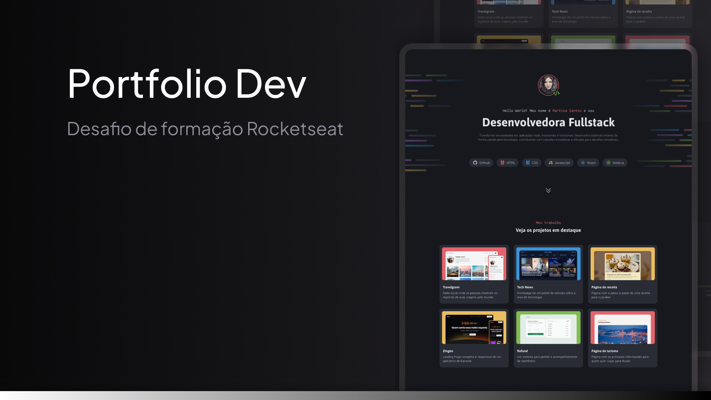

# Desafio prático - Portfólio Dev

<h1 align="center">Portfólio Dev</h1>

Esse projeto foi criado para o desafio prático de portfólio! 🚀
A ideia é aplicar todo o conhecimento adquirido e consolidar minhas habilidades.

  <a href="#-tecnologias">Tecnologias</a>&nbsp;&nbsp;&nbsp;|&nbsp;&nbsp;&nbsp;
  <a href="#-descricao-do-desafio">Descrição</a>&nbsp;&nbsp;&nbsp;|&nbsp;&nbsp;&nbsp;
  <a href="#-layout">Layout</a>&nbsp;&nbsp;&nbsp;|&nbsp;&nbsp;&nbsp;
  <a href="#memo-entrega">Entrega</a>

  

 

## 🚀 Tecnologias

Esse projeto foi desenvolvido utilizando:

- **HTML e CSS**
- CSS Flexbox e Grid
- Posicionamento de elementos
- Variáveis CSS
- Pseudo-classes e Pseudo-elementos

## 💻 Descrição do Desafio

O desafio consiste em criar um site desktop de portfólio para desenvolvedores, onde o foco está na organização e no layout responsivo usando práticas modernas de CSS. O site incluirá links para projetos, contatos e redes sociais.

## 🔖 Layout

Você pode visualizar o layout do projeto no Figma clicando [aqui](https://www.figma.com/community/file/1387080701963671866/portfolio-dev). É necessário ter uma conta no [Figma](https://figma.com).

---

Feito com ♥ e muita dedicação para aprimorar minhas habilidades! 🚀
